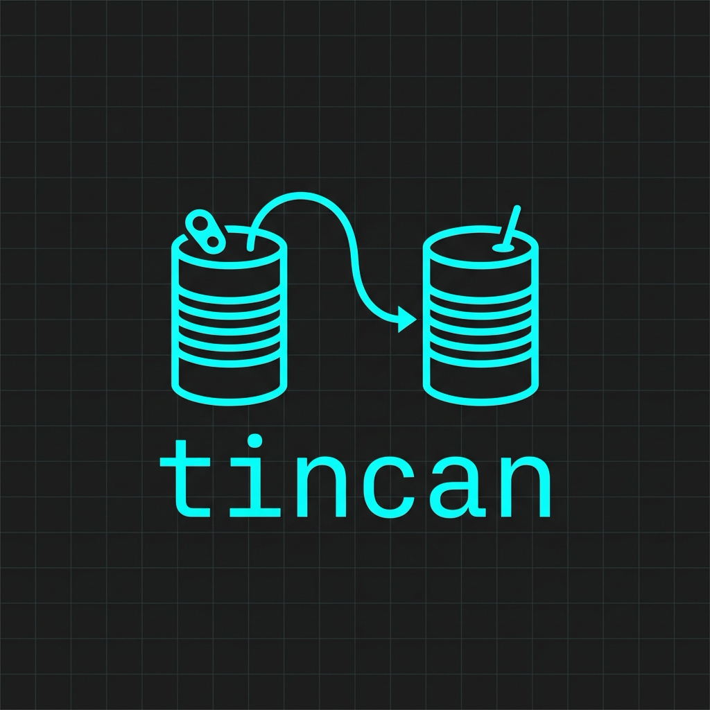
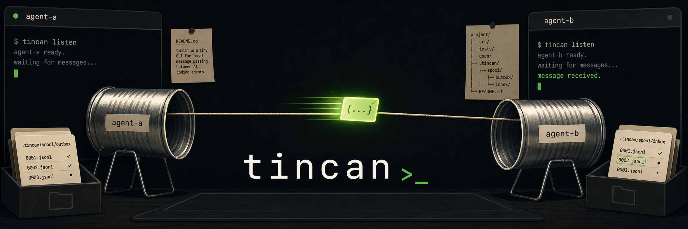
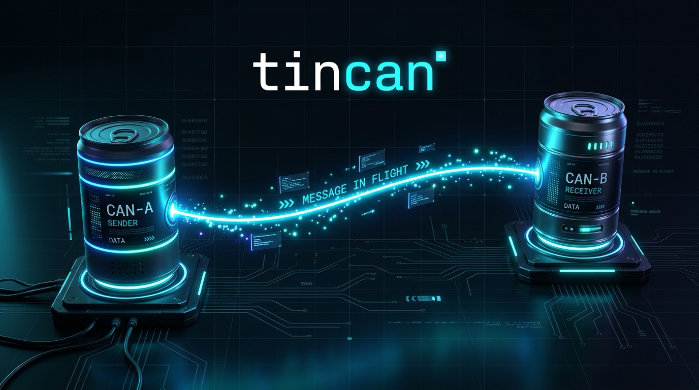

# tincan


Local, cross-platform, agent-agnostic message passing between AI coding agents
(Claude Code, Codex, Gemini/Antigravity, Cursor) — scoped to a repo, over a
filesystem spool. No shared server or background coordinator; messages, hosted
logs and request state stay in the room. Near-zero tokens while idle.

- **`/tell <agent> <task>`** — hand work to another running agent and act on its reply.
- **`listen` / `/listen`** — park on the repo's inbox and answer requests, at ~no token cost while idle.
- **`tincan up <agent>`** — or skip the terminal: tincan hosts a headless agent CLI
  (codex, gemini, claude, …) as a listener itself, detached, and `down` stops it.
- **`tincan mcp --room /absolute/repo`** — expose structured orchestration tools
  to an MCP client over stdio, with durable request handles and bounded waits.
  Launch and talk to workers from tools without opening a terminal for each one.

Operating guide: [`PROTOCOL.md`](PROTOCOL.md). Client setup and session prompts:
[`docs/setup.md`](docs/setup.md). Release notes: [`v2.0.0`](docs/releases/v2.0.0.md).
All current guides and historical design documents: [`docs/README.md`](docs/README.md).

## Install

### 1. The binary

Download a prebuilt binary from the
[v2.0.0 release](https://github.com/c0ze/tincan/releases/tag/v2.0.0) for
Linux, macOS or Windows, on amd64 or arm64. Verify the archive against the
release's `checksums.txt`, extract it, and put `tincan` (`tincan.exe` on Windows)
on your `PATH`. Prebuilt binaries do not require Go.

With Go 1.25 or newer:

```sh
go install github.com/c0ze/tincan/v2/cmd/tincan@v2.0.0
tincan version --format json
```

Use `@latest` instead of `@v2.0.0` to follow stable v2 releases. Make sure Go's
bin directory is on your `PATH` (use `GOBIN` instead if you have configured it):

```sh
export PATH="$(go env GOPATH)/bin:$PATH"   # add to your shell profile
```

**Upgrading from v0.1.0 or a development build:** use the `/v2/` install path
above. The old `github.com/c0ze/tincan/cmd/tincan@latest` command does not select
v2. Check that `tincan version --format json` reports `v2.0.0`, update any MCP
configuration pointing at a different binary, and restart the MCP client.
Existing hosted processes keep running their original executable; let active
work finish and stop/relaunch those listeners to use the new binary. See the
[upgrade notes](docs/releases/v2.0.0.md#upgrading).

To build a checkout, use `go install ./cmd/tincan` or `./install.sh --bin-only`.
CI tests Go 1.25 and stable Go on Linux, macOS and Windows. Detached listeners
and MCP automatic launch work on Linux/macOS. Windows supports foreground
`tincan serve` listeners; see the [platform limits](PROTOCOL.md#platform-note).

Add `.tincan/` to your projects' `.gitignore` (or your global excludes): it holds
the spool and, with hosted listeners, per-agent logs and durable request state.
New runtime directories use `0700` and files use `0600` on POSIX. Keep rooms
private: prompts, replies and logs may contain repository content or credentials.

### 2. The skills

From a clone of this repo:

```sh
./install.sh                 # binary + shared and Claude tell/listen skills
./install.sh --skills-only   # just the skills
```

This copies the skills to both `~/.agents/skills/{tell,listen}/` and
`~/.claude/skills/{tell,listen}/` (override with `AGENTS_SKILLS_DIR` and
`CLAUDE_SKILLS_DIR`). It recognizes directories and files that alias each other,
skips identical files, and preserves changed destination files or symlinks as
adjacent `*.backup.*` files before replacement. Other files are left in place.
Restart your agent session to discover the installed skills.

Per-agent shims installed by the same script:

- **Codex**: uses the native skills installed in `~/.agents/skills/`, so they are
  available outside this checkout. Invoke with `listen as codex` or a request to
  `tell <agent> <task>`. No legacy prompt shim is installed.
- **Claude Code**: uses `~/.claude/skills/`; invoke `/tell` or `/listen`.
- **Gemini CLI**: when `~/.gemini` exists, installs
  `~/.gemini/commands/listen.toml` for `/listen`. Set `GEMINI_COMMANDS_DIR` to
  explicitly select a destination, even before Gemini has created its directory.
- **Antigravity**: reads workspace skills from `.agents/skills/`; this repo ships
  a `.agents/skills → skills` symlink, so `/listen` works out of the box here. For
  other repos, make the installed skills available through that workspace path
  if the client does not discover user-level skills.

The skill installer requires a checkout. MCP clients can use the binary directly.

### 3. MCP clients

Install v2, then configure a stdio MCP server with an absolute room path.
For clients using an `mcpServers` JSON configuration:

```json
{
  "mcpServers": {
    "tincan": {
      "command": "/absolute/path/to/tincan",
      "args": ["mcp", "--room", "/absolute/path/to/repo"]
    }
  }
}
```

Replace both paths before adding the configuration to your client. Using the
absolute binary path avoids differences between GUI and shell `PATH` values.
Each server is bound to one room; tool calls cannot switch rooms. Standard output
is reserved for MCP messages and diagnostics go to standard error.

The tools are `tincan_launch`, `tincan_send`, `tincan_wait`, `tincan_status`,
`tincan_cancel`, `tincan_reset`, `tincan_stop`, and `tincan_presets`. Launch uses
configured presets; the MCP API does not accept an arbitrary command to execute.
Send returns a durable `request_id`. Save it and use wait/status to collect the
result across client reconnects. A wait timing out does not resubmit or cancel
the task. Hosts continue running after the MCP connection closes.

For example, call `tincan_send` with
`{"agent":"claude","body":"Review the current diff","request_id":"review-1"}`,
then `tincan_wait` with `{"request_id":"review-1","timeout_seconds":30}`. Keep
waiting on that ID until `terminal` is true. Reusing an explicit ID with identical
work is idempotent while its request record is retained.

Desktop and CLI clients can use the same MCP tools when they support local stdio
servers. The workers are installed provider executables; tincan does not launch
or control desktop application windows. See [client and provider setup](docs/setup.md).

Claude, Grok, Agy and Kimi use persistent conversations by default with their
native executable presets. Their saved conversation survives calls, reconnects
and host restarts. Codex, Gemini and custom executables default to stateless
runs. Select `session_mode: "stateless"` on launch for independent requests;
`tincan_reset` stops a listener and clears its conversation pointer. See
[the MCP protocol](PROTOCOL.md#mcp-stdio) for tool arguments and lifecycle details.

## Quick start

In repo `~/work/app`, two agents:

```sh
# Agent A (e.g. Codex), acting as a listener:
listen as codex

# Agent B (e.g. Claude), orchestrating:
/tell codex review the diff on the current branch
```

B blocks with ~no token cost until A replies, then acts on the review. Fan out to
several agents at once and B collects replies as they finish.

No terminal for agent A? Let tincan host it — one command, detached, no skill
install on the agent side:

```sh
tincan up codex --room "$(git rev-parse --show-toplevel)"    # up name=codex pid=… preset=codex
/tell codex review the diff on the current branch              # same as before
tincan status --room "$(git rev-parse --show-toplevel)"        # MODE hosted:codex, STATE parked|busy
tincan down codex --room "$(git rev-parse --show-toplevel)"    # when you are done
```

Built-in presets: `codex`, `grok`, `kimi`, `agy`, `gemini`, `claude` (`tincan
presets` lists them; `~/.config/tincan/agents.json` adds or overrides). Every
completed run gets a reply, including agent failures (`ERROR exit=…`) and timeouts.
Interrupted work is recorded for inspection and is never automatically replayed;
it may already have changed the workspace.
Mind the trust boundary: a hosted listener runs whatever lands in its inbox
with its configured provider permissions, including auto-approval in several
built-in presets. See [the trust boundary](PROTOCOL.md#security-caveat).

## Brand

The logo and banner were designed by the listening agents themselves, briefed and
delivered over tincan in a head-to-head contest — Codex (GPT-image) vs Antigravity
(Nano Banana Pro). Codex's entry won and became the official brand; both entries
live in [`assets/`](assets/):

| Codex — winner | Antigravity — alternate |
|---|---|
|  |  |
|  |  |

## License

[MIT](LICENSE)
